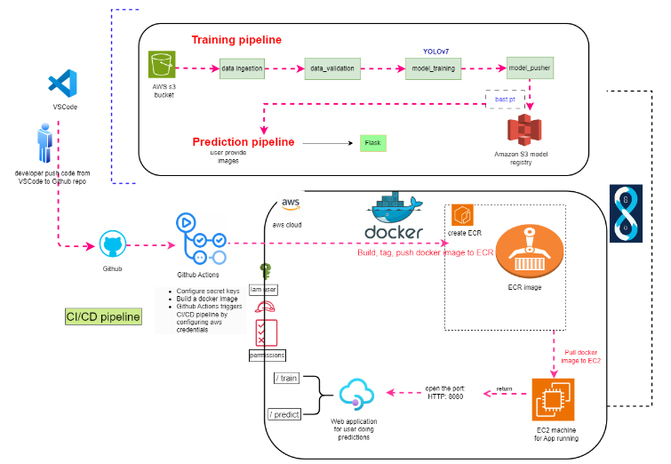
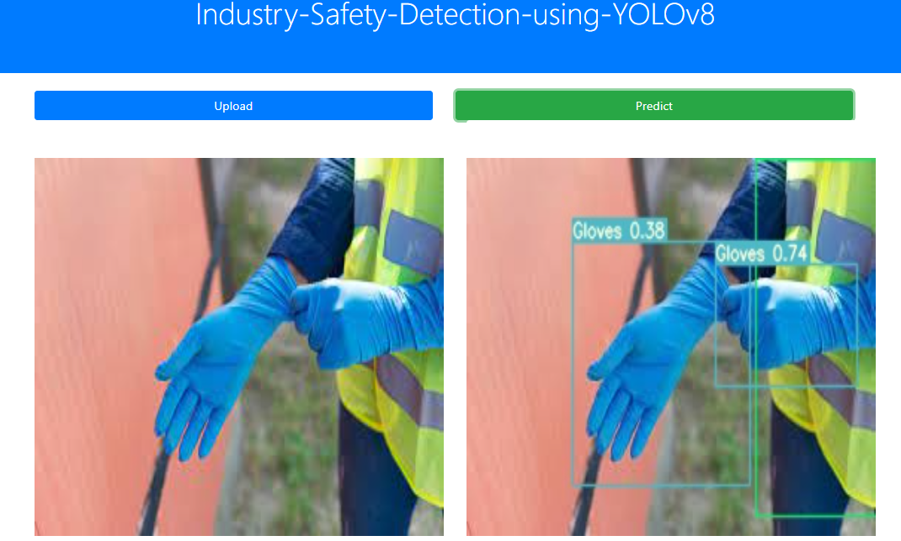
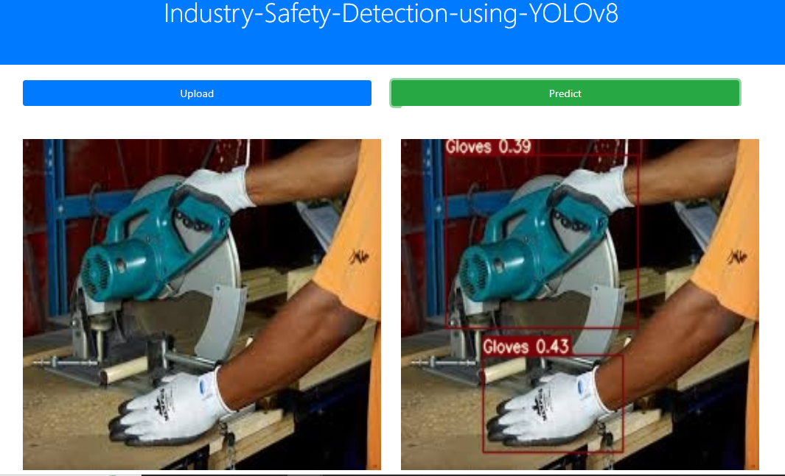

# Industry Safety Detection Using YOLOv7

# Introduction

This project aims to enhance worker safety in industrial environments by developing an **end-to-end MLOps pipeline** for Industry Safety Detection using the **YOLOv7** model. The model is trained to detect 5 different classes, including critical safety-related objects such as 'Helmet', 'Goggles', and 'Gloves'. By leveraging real-time object detection, this system provides an automated solution for identifying safety breaches on industrial sites, reducing the risk of workplace accidents.

The pipeline is designed to streamline the entire **machine learning workflow**, consisting of key stages like **data ingestion**, **data validation**, **model training**, and **model pusher**. Data is automatically ingested and validated to ensure its quality before training the YOLOv7 model.

To ensure seamless deployment and scalability, the project incorporates a **CI/CD pipeline** using **Docker** images. These Docker containers encapsulate the entire model environment, making it easy to deploy the trained models on **AWS**. Specifically, we use **AWS Elastic Container Registry (ECR)** to store and manage Docker images, and the CI/CD pipeline automates the deployment process, ensuring that updates are continuously integrated and tested. This approach enables the project to maintain robust, real-time deployment capabilities in a cloud environment, supporting ongoing improvements and model updates.

## Tech Stack Used
1) Python
2) Flask
3) YOLOv7
4) Docker
5) PyTorch
6) OpenCV

## Infrastructure
1) DockerHub
2) AWS Elastic Container Registry (ECR)
3) GitHub
4) CI/CD pipeline

## System Design


## Dataset

Dataset for this Project is taken from Kaggle. Here is the Dataset [Link](https://www.kaggle.com/datasets/jatinsareen/industrial-site-safety-image-dataset). It contains images of construction sites with various safety-related classes, making it suitable for training object detection models to identify potential safety hazards.

## Dataset Information

* The images are in jpg format to fit the model.
* The dataset contains two folders: **train**, and **valid**.
* There are 5 classes to detect from the dataset:


'**Helmet**', '**Goggles**', '**Jacket**', '**Gloves**', '**Footwear**'

* train represent training set
* val represent validation set
* training set is 120 images
* validation set is 31 images


#### Dataset Details<a id='dataset-details'></a>
<pre>
Dataset Name            : Industrial Site Safety Image Dataset
Number of Class         : 5
Number/Size of Images   : Total      : 151 (2 MB)
                          Training   : 120
                          Validation : 31 

</pre>
## Results<a id='results-'></a>
We have achieved following results with YOLOv7 model for detection of the 5 clasess like ,'**Mask**', '**machinery**', '**Safety Vest**' and others from Construction Site Safety Images.

<pre>
<b>Performance Metrics </b>
mAP_50 Score                                     : 92.00%
mAP_50_95 Score                                  : 49.80%
</pre>

## Installation
    
The Code is written in Python 3.8.19. If you don't have Python installed you can find it here. If you are using a lower version of Python you can upgrade using the pip package, ensuring you have the latest version of pip.

## Run Locally

### Step 1: Clone the repository
```bash
git clone https://github.com/jatin-12-2002/Industry_Safety_Detection_Using_YoloV7
```
### Step 2- Create a conda environment after opening the repository
```bash
conda create -p env python=3.8 -y
```
```bash
source activate ./env
```
### Step 3 - Install the requirements
```bash
pip install -r requirements.txt
```

### Step 4 - Create IAM user with following Permissions Enabled

* **AdministratorAccess**
* **AmazonEC2ContainerRegistryFullAccess**
* **AmazonEC2FullAccess**


### Step 5 - Configure your AWS
```bash
aws configure
```

### Step 6 - Enter your AWS Credentials of IAM User
```bash
AWS_SECRET_ACCESS_KEY = ""
AWS_ACCESS_KEY_ID = ""
AWS_REGION = "us-east-1"
AWS_FOLDER = Press Enter and move on
```
### Step 7 - Prepare your Dataset zip file named isd_data_mini.zip
Your Zip file should contain following folders and files in this order:
```bash
isd_data_mini.zip
│
├── images
│   ├── train
│   └── val
│
├── labels
│   ├── train
│   └── val
│
├── classes.names
│
└── train.txt
│
└── val.txt
```

* **Ensure that the images, and labels directories contain their respective train and val subfolders.**
* **Update the classes.names file with the correct Labels for all the classes.**
* **Here is my Datset: [LINK](https://drive.google.com/file/d/1dVLL1dLXP6EMS8WzDpKgu0SfiAXp8QLP/view?usp=sharing)**

### Step 9 - Upload the Dataset zip file to your S3 Bucket
```bash
aws s3 cp path/to/your/isd_data.zip s3://your-bucket-name/file.zip
```

### Step 10 - If yolov7 folder is not present. Download it
```bash
git clone https://github.com/WongKinYiu/yolov7
```
```bash
rm -rf yolov7/.git
```

### Step 11 - If want to make your own model, Change the following lines in yolov7 folder's Files:

### Step 11.1 - In *yolov7/data/custom.yaml*, Change the train and val paths based on your system's path and give proper path to the train.txt and val.txt files. Also, you can change nc(no. of classes) and class's names according to your needs.

### Step 11.2 - In *yolov7/cfg/training/custom_yolov7.yaml*, you can change nc(no. of classes) according to your needs.

### Step 11.3 - Download the *yolov7.pt* weights in yolov7 folder
```bash
cd yolov7
```
```bash
wget "https://github.com/WongKinYiu/yolov7/releases/download/v0.1/yolov7.pt"
```

### Step 13 (Optional)- Add best.pt model in yolov7 folder
Follow this Step if you don't want to train model for 100 epochs as It will take a long time to complete training. I had already trained model named as **best.pt** for 100 epochs.

As **best.pt** is very large in size(72 MB), So I cannot push it into github repository directly. So, you had to update it manually in and you had to insert the best.pt file in **yolov7 folder**.

You can download the **best.pt** from [here](https://drive.google.com/file/d/1eJRqDVAGSv6iFH4rahv_--LmVWPQYfRP/view?usp=sharing)

### Step 12 - Upload the best.pt model in your S3 Bucket
```bash
aws s3 cp path/to/your/best.pt s3://your-bucket-name/best.pt
```

### Step 12 - Run the application server
```bash
python app.py
```

### Step 13 - Prediction application
```bash
http://localhost:8080/

```

## Prediction Outputs




## AWS Deployment Steps
### Step 1 - Login to AWS console.

### Step 2 - Create IAM user for deployment with following Permissions Enabled

* **AdministratorAccess**
* **AmazonEC2ContainerRegistryFullAccess**
* **AmazonEC2FullAccess**

### Important Points:
1. **EC2 access** : It is virtual machine

2. **ECR**: Elastic Container registry to save your docker image in aws


### Description: About the deployment in the Backend

1. Build docker image of the source code

2. Push your docker image to ECR

3. Launch Your EC2 

4. Pull Your image from ECR in EC2

5. Lauch your docker image in EC2

### Step 3 - Create ECR repo to store/save docker image
```bash
Save your ECR URI: 022499021177.dkr.ecr.us-east-1.amazonaws.com/yolov7application
```

### Step 4 - Create EC2 machine (Ubuntu)
```bash
Use t2.large or greater size instances only as it is a Computer Vision project
```

### Step 5 - Open EC2 and Install docker in EC2 Machine:
### Step 5.1 - This command uses apt-get, the traditional package management tool.
```bash
sudo apt-get update -y
```
### Step 5.2 - This command uses apt, a newer, more user-friendly command-line interface for the APT package management system.
```bash
sudo apt-get upgrade
```
### Step 5.3 - The command downloads the Docker installation script and saves it as get-docker.sh
```bash
curl -fsSL https://get.docker.com -o get-docker.sh
```
### Step 5.4 - The command executes the Docker installation script with elevated privileges (using sudo), ensuring that Docker gets installed properly on your system.
```bash
sudo sh get-docker.sh
```
### Step 5.5 - The command adds the ubuntu user to the docker group, allowing that user to run Docker commands without needing to use sudo every time.
```bash
sudo usermod -aG docker ubuntu
```
### Step 5.6 - This command is used to apply the changes made by adding the user to the docker group without needing to log out and log back in.
```bash
newgrp docker
```
### Step 5.7 - Make sure unzip and curl are installed.
```bash
sudo apt install unzip curl -y
```
### Step 5.8 - Use curl to download the latest AWS CLI v2 installation zip file.
```bash
curl "https://awscli.amazonaws.com/awscli-exe-linux-x86_64.zip" -o "awscliv2.zip"
```
### Step 5.9 - Unzip the downloaded file.
```bash
unzip awscliv2.zip
```
### Step 5.10 - Run the following command to install the AWS CLI.
```bash
sudo ./aws/install
```
### Step 5.11 - Configure AWS CLI with your credentialss.
```bash
aws configure
```
### Step 5.12 - Enter your AWS Credentials of IAM User.
```bash
AWS_SECRET_ACCESS_KEY = ""
AWS_ACCESS_KEY_ID = ""
AWS_REGION = "us-east-1"
AWS_FOLDER = Press Enter and move on
```

### Step 6 - Configure EC2 as self-hosted runner:
```bash
Repository-->actions--> runner--> new self hosted runner--> choose linux--> then run command one by one
```

### Step 7 - Setup github secrets:
```bash
AWS_ACCESS_KEY_ID=

AWS_SECRET_ACCESS_KEY=

AWS_REGION = us-east-1

AWS_ECR_LOGIN_URI = demo>>  022499021177.dkr.ecr.us-east-1.amazonaws.com

ECR_REPOSITORY_NAME =
```

### Step 8 - Add Inbound Rules in EC2 Instance
```bash
Select your EC2 Instance--> Security groups--> Add Inbound Rules--> Custom TCP(8080 and 0.0.0.0)--> save
```

### Step 9 - Run the Public Port of EC2 Instance
```bash
Public_Address:8080
```

## Conclusion 
1. The **YOLOv7** model effectively detects 5 safety-related classes in real-time, achieving impressive mAP scores of **92.00% (mAP50)** and **49.80% (mAP50-95)**, significantly improving workplace safety on industrial sites.
2. The **MLOps pipeline** ensures an efficient and scalable process, from data ingestion to model deployment, making the system adaptable for ongoing improvements and updates.
3. The integration of **CI/CD pipelines** with **Docker** and **AWS** infrastructure enables seamless deployment, continuous integration, and rapid updates, allowing for efficient scalability.
4. This solution provides a robust and scalable system for industry safety detection, with potential for future enhancements such as real-time alerting and incorporating more complex detection models.
5. Future enhancements could include adding more safety-related classes, integrating live video feeds, and improving the **CI/CD pipeline** for faster deployment.

## Some Common Errors and their Solutions

### Error-1 : ImportError: libGL.so.1: cannot open shared object file: No such file or directory
### Solution: Enter the following commands in your git bash terminal
```bash
sudo apt-get update

sudo apt-get install mesa-utils

sudo apt-get install libgl1-mesa-glx
```